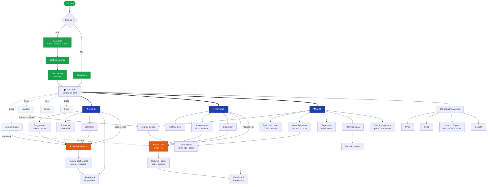
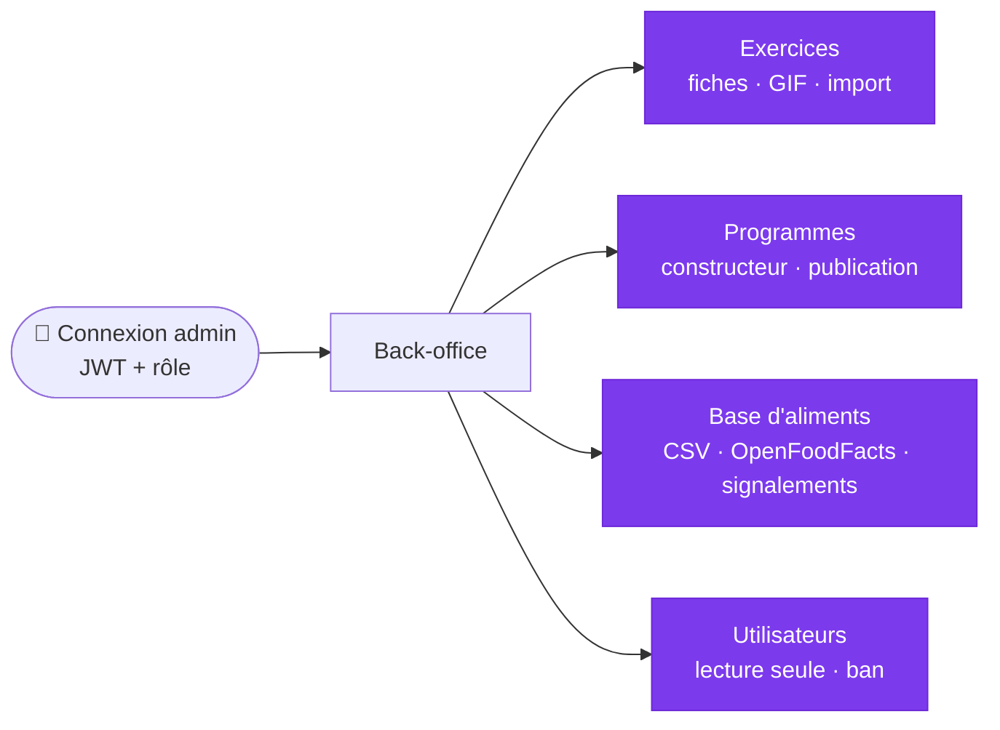

# Architecture Applicative — Pages & Fonctionnalités

> Vue transversale : **arborescence des écrans**, description de **chaque page** et **descriptif complet des fonctionnalités**, pilier par pilier.
> Documents sources : [[Base Appli]] · [[Vision & Contexte]] · [[Navigation & UX Globale]] · [[Compte & Profil Utilisateur]] · [[Musculation]] · [[Running]] · [[Alimentation]] · [[Outils d'Administration]] · [[Architecture Technique]]

---

## 1. Vue d'ensemble

Application mobile de suivi fitness **tout-en-un** (iOS + Android) articulée autour de **trois piliers connectés** — musculation, running, alimentation — plus un **back-office web** de gestion de contenu réservé à l'équipe.

| Brique | Nature | Utilisateurs |
|---|---|---|
| **App mobile** | React Native (Expo), offline-first, SQLite local + sync cloud | Utilisateurs finaux |
| **API / Backend** | Node (Fastify/NestJS) + PostgreSQL, Auth JWT | — |
| **Back-office** | Web (React/Next), sous-domaine `admin.*` | Équipe (super_admin / content_editor / moderator) |

**Principe structurant** : les piliers se parlent — le TDEE s'adapte aux jours d'entraînement, le calendrier running évite les collisions avec la muscu, le poids corporel alimente les calculs nutritionnels. Voir §8 (Fonctionnalités transverses).

**Navigation principale** — bottom tab bar à 4 onglets, les piliers non activés étant masqués :

```
[ Accueil ]   [ Muscu ]   [ Running ]   [ Alim ]
```

---

## 2. Cartographie des écrans (arborescence)

```
APP MOBILE
│
├── 🔐 Authentification (hors nav bar)
│    ├── Écran d'accueil / Splash
│    ├── Inscription (email·mdp / Google / Apple)
│    ├── Vérification email
│    ├── Connexion
│    └── Récupération de mot de passe
│
├── 🚀 Onboarding (5 étapes, hors nav bar)
│    ├── 1. Informations de base
│    ├── 2. Activités pratiquées
│    ├── 3. Objectif principal
│    ├── 4. Alimentation (optionnel)
│    └── 5. Récapitulatif & confirmation
│
├── 🏠 ONGLET ACCUEIL
│    └── Tableau de bord (blocs : Séance du jour · Nutrition · Streak · Poids)
│         └── Widgets configurables (record récent, volume muscu, résumé running…)
│
├── 🏋️ ONGLET MUSCU
│    ├── Accueil pilier (programme actif + accès rapides)
│    ├── Calendrier des séances
│    ├── Bibliothèque de programmes → Détail programme
│    ├── Création / édition de programme custom
│    ├── Bibliothèque d'exercices → Fiche exercice (GIF, progression, PR)
│    ├── Création d'exercice perso
│    ├── ▶️ Suivi de séance (planifiée ou libre) → Résumé post-séance
│    ├── Historique des séances → Détail séance
│    └── Progression (courbes, records, volume par groupe musculaire)
│
├── 🏃 ONGLET RUNNING
│    ├── Accueil pilier (programme actif + accès rapides)
│    ├── Profil coureur
│    ├── Calendrier des séances
│    ├── Bibliothèque de programmes → Détail programme
│    ├── Création / édition de programme custom
│    ├── Types de séance (endurance / fractionné / sortie longue / récup / libre)
│    ├── ▶️ Suivi GPS temps réel → Résumé post-séance (carte, splits)
│    ├── Historique des séances → Détail + carte (+ export GPX)
│    └── Progression (stats globales, évolution allure, records)
│
├── 🍽️ ONGLET ALIM
│    ├── Journal alimentaire du jour (navigation temporelle)
│    │    ├── Recherche / scan d'aliment → Ajout à un repas
│    │    └── Quick add / Copier un repas / Dupliquer une journée
│    ├── Profil nutritionnel (TDEE, macros, restrictions)
│    ├── Base d'aliments (recherche, favoris, récents)
│    ├── Création d'aliment perso
│    ├── Recettes & Repas types → Création recette / template
│    ├── Planning repas de la semaine → Liste de courses générée
│    └── Suivi & Progression (poids, apports moyens, corrélation muscu)
│
└── ⚙️ Profil & Paramètres (accessible depuis l'accueil)
     ├── Profil utilisateur (données perso, fitness, préférences)
     ├── Poids corporel (saisie + courbe)
     ├── Paramètres (unités, thème, langue, notifications)
     ├── Import / Export de données
     ├── Aide & support · Mentions légales
     └── Gestion du compte (mot de passe, suppression, déconnexion)


BACK-OFFICE WEB (équipe)
├── Connexion admin
├── Module Exercices (liste, formulaire, média/GIF, référentiel muscles)
├── Module Programmes (liste, constructeur de séances, publication)
├── Module Base d'aliments (liste, formulaire, import CSV/OpenFoodFacts, signalements)
└── Module Utilisateurs (lecture seule, bannissement)
```

---

## 2 bis. Diagramme de flux de navigation

> Rendu nativement par Obsidian. Vert = points d'entrée · Bleu = les 4 onglets · Orange = écrans de suivi actif (temps réel).



**Back-office web** (parcours séparé) :



---

## 3. Écrans transverses

### 3.1 Authentification
> Réf. [[Compte & Profil Utilisateur]]

| Écran | Description | Fonctionnalités |
|---|---|---|
| **Inscription** | Création de compte | Email + mot de passe, ou OAuth **Google / Apple** ; acceptation CGU + politique de confidentialité (case à cocher) ; contrôle d'âge ≥ 16 ans (déclaratif via date de naissance, RGPD) ; **pas de compte invité** |
| **Vérification email** | Confirmation obligatoire | Accès complet bloqué tant que l'email n'est pas vérifié |
| **Connexion** | Retour utilisateur | Session persistante (pas de reconnexion à chaque ouverture) |
| **Récupération mdp** | Mot de passe oublié | Réinitialisation par email |

### 3.2 Onboarding (5 étapes)
Séquence de premier lancement, **sautable** et complétable plus tard depuis les paramètres.

1. **Informations de base** — prénom, date de naissance, sexe (optionnel, pour TDEE), poids + taille.
2. **Activités pratiquées** — sélection des piliers actifs (Muscu / Running / les deux) + fréquence hebdo envisagée. *Détermine les onglets affichés.*
3. **Objectif principal** — Prise de masse / Perte de poids / Performance running / Santé générale. *Influence recommandations de programmes et calcul calorique.*
4. **Alimentation (optionnel)** — activer le suivi (Oui / Non / Plus tard) ; si oui, restrictions (végétarien, sans gluten, allergies).
5. **Récapitulatif & confirmation** — résumé des choix + TDEE calculé ; bouton « C'est parti » → dashboard avec **suggestion de premier programme** adapté au profil.

### 3.3 Tableau de bord (Accueil)
> Réf. [[Navigation & UX Globale]]

Vue synthétique de la journée, **max 4 blocs**, réorganisables/masquables/configurables.

| Bloc | Contenu | Action |
|---|---|---|
| **Séance du jour** | Prochaine séance planifiée (nom + heure) ou « repos actif ✓ » | Bouton **Démarrer** → suivi de séance en 1 tap |
| **Nutrition** | Calories consommées / objectif + barre macros (P/G/L) | Bouton **Ajouter un repas** |
| **Streak / Régularité** | Jours consécutifs actifs + calendrier semaine (L→D) coloré | — |
| **Poids corporel** | Dernière pesée + tendance 7 j (↑↓=) | Lien vers la courbe complète |

- **Temps réel** : le dashboard se met à jour pendant une séance.
- **Widgets additionnels** configurables : record récent, volume muscu de la semaine, résumé running de la semaine.
- **États vides** soignés (illustration + phrase + CTA) ; premier lancement guidé vers la première action utile.

### 3.4 Profil & Paramètres
> Réf. [[Compte & Profil Utilisateur]]

- **Données personnelles** : prénom, email (re-vérification si modifié), date de naissance, sexe, poids (historisé), taille.
- **Données fitness** : objectif principal (recalcule TDEE), niveau déclaré par pilier, fréquence hebdo visée.
- **Préférences** : unités (métrique / impérial), langue (FR en V1), thème (clair / sombre / système), notifications par type.
- **Poids corporel** : saisie manuelle, historique + courbe, rappel optionnel, lien automatique avec le TDEE.
- **Compte** : changer le mot de passe, **export** (JSON/CSV), **import** (GPX Strava, CSV Hevy/Strong/MyFitnessPal), aide & support (FAQ + contact/bug), mentions légales, **suppression du compte** (double confirmation, irréversible sous 30 j), déconnexion.

---

## 4. Pilier Musculation
> Réf. [[Musculation]]

### 4.1 Écrans & pages

| Écran | Description |
|---|---|
| **Accueil pilier** | Programme actif, prochaine séance, accès rapides (séance libre, calendrier, historique) |
| **Calendrier des séances** | Séances générées par le programme actif ; jours entraînement/repos colorés ; **décalage par glisser-déposer** ; report/saut d'une séance manquée |
| **Bibliothèque de programmes** | Programmes pré-construits (non modifiables, « dupliquer pour personnaliser ») ; filtres objectif / niveau / durée / équipement |
| **Détail programme** | Fiche (nom, objectif, niveau, durée, fréquence, créateur) + composition semaine par semaine |
| **Création / édition programme** | Assistant : métadonnées → semaine type → composition des séances (exercices, séries/reps/repos) → progression auto optionnelle |
| **Bibliothèque d'exercices** | Recherche par nom/muscle/matériel, favoris (étoile), exercices app + persos |
| **Fiche exercice** | Muscles ciblés, matériel, difficulté, type de mouvement, **GIF de démonstration**, consignes, variantes, **données de progression** (historique sets, PR, courbe charge, volume/semaine) |
| **Création d'exercice perso** | Champs libres + photo personnelle optionnelle |
| **▶️ Suivi de séance** | Écran actif d'entraînement (voir 4.3) |
| **Résumé post-séance** | Durée, volume, séries, records battus, ressenti global |
| **Historique** | Liste des séances passées (tri date, filtre programme/groupe) → détail complet |
| **Progression** | Courbes par exercice, records personnels, **volume par groupe musculaire** (heatmap) |

### 4.2 Programmes & exercices — fonctionnalités

- **Programme** = plan structuré sur plusieurs semaines ; **un seul actif par pilier** (en changer désactive le précédent sans perdre l'historique).
- **Bibliothèque de programmes** app + **création custom** (semaine type, composition, séries/reps/repos, **progression automatique** optionnelle ex. +2,5 kg/sem sur composés).
- **Planning calendrier** auto-généré, décalable, avec gestion des séances manquées.
- **Bibliothèque d'exercices** app (non modifiable) + **exercices persos** ; **GIF de démonstration** consultable en séance sans couper le chrono de repos ; source des GIF : base open source importée via l'admin (candidats : `exercises-dataset`, `free-exercise-db`, `ExerciseDB`).

### 4.3 Suivi de séance — fonctionnalités détaillées

**Deux modes de démarrage**
- **Séance planifiée** — pré-remplie depuis le programme/calendrier.
- **Séance libre** — démarrage à vide, ajout d'exercices au fil de l'eau ; comptabilisée comme une séance normale (historique, volume, records, streak).

**Pendant la séance**
- Vue exercice en cours : série en cours (« 2/4 »), charge/reps prévues, **dernière performance affichée** (« la dernière fois : 80 kg × 8/8/7 »), champs réels **pré-remplis** modifiables en 2 taps, bouton **Valider la série**.
- **Types de séries** : normale · échauffement (exclue du volume/records/progression) · superset (chrono après la paire) · durée (gainage, en secondes) · poids de corps (reps + lest/assistance).
- **Chrono de repos** auto après validation, durée par exercice (défaut 90 s / 120 s composés), alerte + vibration, ignorable/prolongeable.
- **Ajustements en direct** : ajouter/supprimer une série, modifier charge/reps, **remplacer un exercice** par une variante, réorganiser l'ordre.
- **Notes** : note de séance (libre) + note par exercice **persistante** (réglage siège, position machine…).
- Écran maintenu actif (pas de veille) ; grosses zones tactiles ; feedback (animation + son désactivable) ; **animation de célébration** sur nouveau record.

**Fin de séance**
- Résumé (durée, volume total kg, séries, records) + **ressenti global** (1-5 ou RPE 1-10) → Terminer et enregistrer.
- **Abandon/pause** : une séance en pause est reprenable dans les **4 h** ; clôture automatique au-delà de **3 h**.

### 4.4 Historique & progression
- Historique filtrable ; **courbes d'évolution** par exercice (charge max, volume, **1RM estimé — formule d'Epley** `charge × (1 + reps/30)`) ; sélecteur 4 sem / 3 mois / 1 an / tout.
- **Records personnels** (charge max, meilleur reps × charge) avec notification + animation.
- **Volume par groupe musculaire** en heatmap + **alerte de déséquilibre** (ex. 0 set dos vs 12 sets pecs sur 2 semaines).

**Règles métier clés** : charges en kg (converties en lbs si impérial) · progression auto seulement si ≥ 80 % des séries prévues complétées · **deload** proposé (−10 %) après 2 semaines d'échec · échauffements exclus des calculs · volume poids de corps calculé avec le poids courant.

---

## 5. Pilier Running
> Réf. [[Running]]

### 5.1 Écrans & pages

| Écran | Description |
|---|---|
| **Accueil pilier** | Programme actif, prochaine sortie, accès rapides (course libre, calendrier, historique) |
| **Profil coureur** | Objectif (5/10 km, semi, marathon, perte de poids, endurance), niveau, **allure de référence**, fréquence hebdo, FCmax (préparé pour V2) |
| **Calendrier des séances** | Placées selon la semaine type ; **synchronisé avec la muscu** (alerte de chevauchement) ; décalage par glisser-déposer ; report/saut |
| **Bibliothèque de programmes** | Programmes app par objectif ; filtres objectif/niveau/durée ; courbe de volume/semaine |
| **Détail / création programme** | Métadonnées, semaine type, volume par semaine, **progression auto (charge progressive)** |
| **Types de séance** | Endurance fondamentale · Fractionné (VMA) · Sortie longue · Récupération active · Course libre |
| **▶️ Suivi GPS temps réel** | Écran actif de course (voir 5.3) |
| **Résumé post-séance** | Distance, durée, allure, carte, dénivelé, splits/km, comparaison objectif, records |
| **Historique** | Liste (tri date, filtre type/programme) → détail + carte ; **export GPX** |
| **Progression** | Stats globales, évolution de l'allure, records personnels |

### 5.2 Types de séance — fonctionnalités
> En V1, **toutes les intensités sont en allure** (dérivées de l'allure de référence) — les équivalents FC arrivent en V2 avec les wearables.

- **Endurance fondamentale** — allure réf. +60 à 90 s/km, 30-90 min, base aérobie.
- **Fractionné / VMA** — blocs rapides/récup structurés (ex. « 6 × 400 m à 95 % VMA, récup 1 min 30 ») avec **alerte auto au changement de bloc** (son + vibration).
- **Sortie longue** — la plus longue de la semaine, allure réf. +30 à 60 s/km, **+10 % max/semaine**.
- **Récupération active** — très lente, 20-30 min max, après séance intense.
- **Course libre** — GPS + chrono sans structure ; comptabilisée (historique, stats, records, streak).

### 5.3 Suivi GPS — fonctionnalités détaillées

**Écran temps réel** : distance (en grand), temps écoulé, **allure instantanée** (minute glissante), allure moyenne, **carte du parcours en direct**, bloc en cours + chrono du bloc (fractionnés).

- **Guidage fractionné** : annonce vocale + vibration au changement de bloc, compte à rebours.
- **Annonces audio périodiques** : à chaque km (paramétrable 0,5/1/2 km ou off) — distance, temps, allure moyenne.
- **Auto-pause** : chrono + GPS en pause à l'arrêt (feu rouge, lacet), reprise auto ; activable/désactivable.
- **Écran verrouillé** : données visibles et contrôlables — iOS **Live Activity** (verrouillage + Dynamic Island), Android **notification persistante** avec actions pause/reprise.
- **Ajustements** : raccourcir (terminer maintenant), prolonger (mode libre après la cible), mettre en pause. Note texte libre.

**Fin de séance** : ressenti (RPE/étoiles) + conditions (météo, terrain) → **résumé** (distance, durée, allure, **carte tracée**, dénivelé ±, **découpage par km**, comparaison objectif, records) → Enregistrer.

### 5.4 Historique & progression
- Historique filtrable + **export GPX** par sortie.
- **Stats globales** : distance/dénivelé/temps (semaine/mois/total), nombre de séances par type.
- **Évolution de l'allure** par type de séance (pour ne pas mélanger fractionné et footing).
- **Records personnels** 1/5/10 km, semi, marathon — **calculés automatiquement** depuis le GPS (meilleur segment glissant, un record 5 km peut tomber pendant un 12 km) + notification/animation.

**Règles métier clés** : GPS requis, sinon **mode manuel** (durée seule, exclue des records d'allure mais compte pour streak/stats) · règle des 10 % suggérée non imposée · **allure de référence mise à jour auto** si record 5 km battu · carte rendue côté app (pas de dépendance Google Maps runtime) · un seul programme actif à la fois.

---

## 6. Pilier Alimentation
> Réf. [[Alimentation]]

### 6.1 Écrans & pages

| Écran | Description |
|---|---|
| **Journal alimentaire** | Vue principale = une journée ; total permanent en haut ; navigation ◀ Hier / Aujourd'hui / Demain ▶ + calendrier mensuel |
| **Recherche / scan d'aliment** | Recherche par nom (suggestions temps réel), **scan code-barres** (base ou OpenFoodFacts), récents, favoris |
| **Ajout à un repas** | Sélection quantité (portion usuelle par défaut, grammes à un tap) |
| **Profil nutritionnel** | Objectif, **TDEE**, répartition macros, restrictions/allergènes |
| **Base d'aliments** | Référentiel app + importé + perso |
| **Création d'aliment perso** | Nom + calories obligatoires, macros optionnelles |
| **Recettes & repas types** | Composer un plat multi-aliments réutilisable ; templates de repas |
| **Planning repas** | Semaine à l'avance ; objectif calorique adapté aux jours d'entraînement |
| **Liste de courses** | Générée depuis le planning, regroupée par catégorie, cases à cocher, export |
| **Suivi & progression** | Poids, apports moyens, corrélation avec la muscu |

### 6.2 Profil nutritionnel — fonctionnalités
- **Objectif** : prise de masse / sèche / maintien / perte progressive (déficit ou surplus calorique associé).
- **Calcul TDEE** : métabolisme de base **Mifflin-St Jeor** × facteur d'activité (sédentaire ×1,2 → extrêmement actif ×1,9), **ajusté automatiquement selon le planning d'entraînement**, ajustement manuel possible.
- **Macros** : répartition par défaut selon l'objectif, modifiable en g ou %, **recalcul auto des deux vues**.
- **Restrictions** : végétarien / végétalien / sans gluten / sans lactose / halal / casher + allergènes (liste libre + prédéfinie).

### 6.3 Base d'aliments — fonctionnalités
- Structure : valeurs pour 100 g (calories, protéines, glucides dont sucres, lipides dont saturés, fibres), catégorie, code-barres, **source** (app vérifiée / utilisateur / OpenFoodFacts).
- **Recherche** par nom, **scan code-barres**, récents, favoris.
- **Aliments personnalisés** (nom + calories obligatoires) flaggés « personnalisé ».

### 6.4 Journal alimentaire — fonctionnalités détaillées
- **4 repas par défaut** (petit-déj / déjeuner / dîner / collation), repas ajoutables et renommables (pré/post-workout).
- **Ajout** : sélection repas → recherche/scan → quantité (**portions usuelles** : « 1 œuf = 60 g ») → valeurs calculées.
- **Saisie rapide** : **Copier un repas** (« même petit-déj qu'hier », 2 taps), **Dupliquer une journée**, **Quick add** (calories + macros optionnelles, sans recherche — resto/estimé).
- **Total du jour** permanent : calories consommées/objectif, restantes (ou dépassement en rouge), barres par macro (g + %).
- **Navigation temporelle** libre (aucune limite de rétroactivité) + calendrier mensuel avec jours complétés surlignés.

### 6.5 Recettes, planning & courses
- **Recettes** : composition multi-ingrédients + nombre de portions → valeurs auto ; apparaissent dans la recherche comme un aliment.
- **Repas types (templates)** : enregistrer un repas complet, réutilisable en 1 tap (**snapshot** au moment de l'ajout, non affecté par les modifications ultérieures).
- **Planning repas** (module optionnel) : semaine avec 4 cases/jour, valeurs calculées temps réel, **objectif calorique adapté aux jours d'entraînement** (+100 à +300 kcal).
- **Liste de courses générée** : depuis le planning, regroupée par catégorie, cases à cocher, exportable (texte/PDF).

### 6.6 Suivi & progression
- **Poids corporel** : saisie, courbe (4 sem / 3 mois / 1 an), tendance, objectif optionnel (progression en %).
- **Évolution des apports** : calories moyennes 7/30 j, moyenne par macro, jours avec objectif atteint (90-110 % des cibles).
- **Corrélation muscu** : vue croisée séances vs apports de la semaine + **alerte de déficit** sur semaine à fort volume.

**Règles métier clés** : journal passé modifiable · historique non recalculé si l'objectif change · macros en g priment sur % · mention « cru/cuit » sur les aliments concernés · hydratation reportée en V2.

---

## 7. Back-office web (administration)
> Réf. [[Outils d'Administration]]

Application **web séparée** (`admin.appfitness.com`), auth JWT + vérification du rôle, réservée à l'équipe.

| Module | Fonctionnalités |
|---|---|
| **Exercices** | Liste paginée + filtres ; formulaire (onglets Informations & Média) : muscles, matériel, difficulté, type de mouvement, consignes markdown, variantes, statut ; **upload GIF** + thumbnail ; **import en masse** (JSON+GIF, créés en brouillon) ; référentiel des groupes musculaires |
| **Programmes** | Liste + filtres ; métadonnées + **constructeur de séances** (semaine type, drag & drop, exercices/séries/reps/repos) ; publication brouillon→publié ; **modification d'un programme publié = nouvelle version brouillon** (utilisateurs actifs non affectés) |
| **Base d'aliments** | Liste + filtres ; formulaire nutritionnel complet ; **import CSV** (validation ligne par ligne) + **import OpenFoodFacts** par code-barres ; **signalements utilisateurs** (valider/corriger/supprimer) |
| **Utilisateurs** (lecture seule V1) | Liste paginée, recherche email, vue profil lecture seule, **bannir/débannir** avec motif |

**Rôles** : `super_admin` (CRUD complet + utilisateurs) · `content_editor` (CRUD contenu, aucun accès utilisateurs) · `moderator` (lecture + signalements + bannissement).

**Règles** : suppression = **archivage** (soft delete) sauf action super_admin explicite · **log d'audit** immuable de toute action admin.

---

## 8. Fonctionnalités transverses

Ce qui fait la spécificité de l'app : les piliers **se parlent**.

| Fonctionnalité | Description |
|---|---|
| **Streak de régularité** | Jours consécutifs avec ≥ 1 activité validée (séance muscu/running **ou** journée nutrition complète) ; un jour de repos prévu est **neutre** ; bascule à minuit fuseau local, jamais cassé rétroactivement |
| **Records personnels** | Muscu (charge, 1RM, reps×charge) + running (allures par distance), calculés automatiquement, avec notification + animation de célébration |
| **TDEE adaptatif** | Le besoin calorique et le planning repas **s'ajustent aux jours d'entraînement** (muscu/running → facteur/objectif plus élevé) |
| **Calendrier unifié** | Muscu + running dans le même planning, **alerte de chevauchement** entre les deux piliers |
| **Poids ↔ nutrition** | Les pesées alimentent le TDEE (mise à jour auto) ; corrélation apports vs volume d'entraînement |
| **Notifications** | Rappel séance (30 min avant), rappel repas, rappel pesée, streak en danger, nouveau record — **max 3/jour**, DND 22h-7h ; toutes désactivables |
| **Offline-first** | Écriture locale prioritaire (SQLite), sync cloud dès connexion, **last-write-wins** ; bandeau discret hors-ligne |
| **Intégrations** | Apple Health / Health Connect (écriture séances, lecture poids) ; **import GPX** (Strava) et **CSV** (Hevy, Strong, MyFitnessPal) ; **export** JSON/CSV/GPX |
| **Accessibilité** | Dynamic Type, contraste WCAG AA, jamais la couleur seule comme indicateur |

> **Hors périmètre V1** (voir [[Vision & Contexte]]) : gamification/mini-jeu RPG (V3-V4), wearables + zones cardio FC (V2), social/défis (V2), hydratation (V2), coach IA, sync continue Strava/Garmin, animations 3D. Le modèle de données reste compatible avec un ajout ultérieur de la couche jeu (historique horodaté = journal d'événements).

---

## 9. Récapitulatif — inventaire des pages

**Transverses (11)** : Splash · Inscription · Vérification email · Connexion · Récupération mdp · Onboarding ×5 · Dashboard · Profil · Poids · Paramètres · Import/Export.
**Musculation (11)** : Accueil · Calendrier · Bibliothèque programmes · Détail programme · Création programme · Bibliothèque exercices · Fiche exercice · Création exercice · Suivi séance · Résumé · Historique/Progression.
**Running (10)** : Accueil · Profil coureur · Calendrier · Bibliothèque programmes · Détail/Création programme · Types de séance · Suivi GPS · Résumé · Historique · Progression.
**Alimentation (10)** : Journal · Recherche/scan · Ajout repas · Profil nutritionnel · Base d'aliments · Création aliment · Recettes/templates · Planning repas · Liste de courses · Suivi/progression.
**Back-office (5)** : Connexion admin · Exercices · Programmes · Aliments · Utilisateurs.

> Pour le détail exhaustif fonctionnalité par fonctionnalité avec statut et version de développement, voir [[Validation Fonctionnalités]] (179 fonctionnalités ordonnées V0.1 → V1.1).
